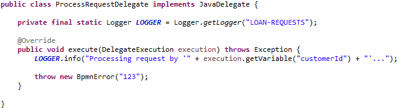
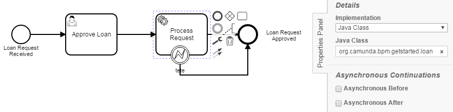
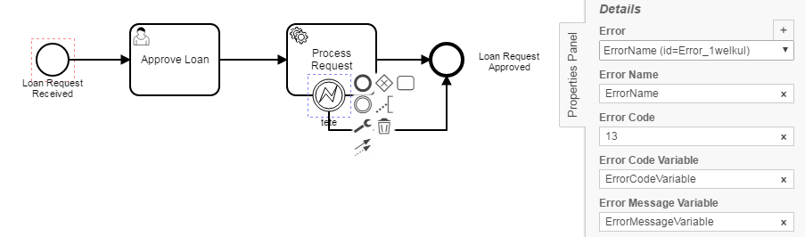

BoundaryErrorChecker
=================================
The BoundaryErrorChecker processes BPMN models and checks whether a BoundaryErrorEvent and its ErrorCode is referenced in the tasks corresponding class/bean.

## Assumptions
- The **BPMN-models** have to be in the **classpath** at build time

## Configuration
The rule should be configured as follows:
```xml
<rule>
  <name>BoundaryErrorChecker</name>
  <state>true</state>
</rule>

```

## Error messages
**ErrorCode of %BoundaryErrorEvent% does not match with throwing declaration of class 'org.camunda.bpm.getstarted.loanapproval.ProcessRequestDelegate'**

_This message indicates that the ErrorCode of the underlying task and its referenced class does not get caught by the BoundaryErrorEvent because of varying ErrorCodes._


## Examples

| **Example of code with "throw new BpmnError("123")"**                                                                                    |
|:------------------------------------------------------------------------------------------------------:| 
|         |


| **BoundaryErrorEvent attached to task (has to have either correct class reference or bean mapping)**                                                                                    |
|:------------------------------------------------------------------------------------------------------:| 
|         |


| **BoundaryErrorEvent with ErrorCode and other attributes**                                                                                    |
|:------------------------------------------------------------------------------------------------------:| 
|         |
