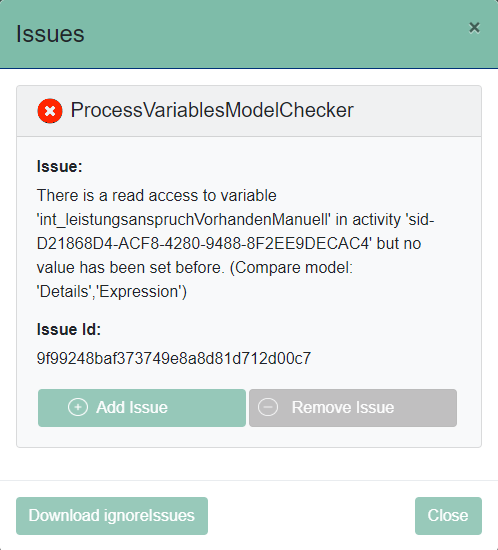

# Exclusion of false positives
An ignore file can be created to exclude false positives. The file has to be named `ignoreIssues.txt` and stored in `src/test/resources`. 
Here, you can list IDs of the issues which should be ignored in the next validation run. This must be done line by line. Line comments are initiated with `#`.

Unique IDs are generated by a Message Digest. In the files `bpmn_validation.json` or `bpmn_validation.xml`, you can find each issue attached to its respective ID. 
Additionally, if you open the modal by clicking an element with issues, the a modal with detailed information will be shown, also including the respective unique ID.  
You can also directly whitelist an issue and then download your new ignoreIssues.txt file. 
This provides a convenient way to avoid copy & pasting your issues into your project.



**Example**
```
# Comment 
8d04f2e77a7d282c521098ab947ac060
```
