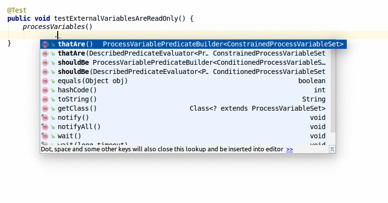

# Data Flow Validation Language
The data flow validation language is a DSL embedded in Java and provides functionality for defining data flow rules and automated validating against process applications.


## Language Design
On a high-level, the language consists of five elements:
* *Process variables* containing operations and all relevant information, e.g. location and type.
* *Constraints* for filtering the set of process variables of a process application, that are subjects to a rule.
* *Conditions* defining properties of process variable that need to be complied to.
* *Reasons* provide the opportunity to convey the intention behin a rule.
* *Criticality* defines whether a violation leads to an error or just warnings/information.

## Example Rules

The first of the following example is animated to demonstrate the use of auto-complete aiding in the definition of rules. The subsequent example show common use cases for defining DFVL rules.

### Read-only variables for external data



### Prevent writes at sequences flows

```java
DataFlowRule rule = processVariables()
    .shouldBe().not().written().byModelElements().ofType(SequenceFlow.class);
```

### Prevent access by elments without necessary properties

```java
Collection<String> blacklist = Arrays.asList(".*[eE]mail.*", ".*[cC]ustomer.*",
        ".*[cC]ontract.*", ".*bank[aA]ccount.*", ".*[pP]olicy.*");
ConstrainedProcessVariableSet filteredVariables = null;
for (String pattern : blacklist) {
    if (filteredVariables == null)
        filteredVariables = processVariables().thatAre().matching(pattern);
    else
        filteredVariables = filteredVariables.orThatAre().matching(pattern);
}
DataFlowRule rule = filteredVariables
        .shouldBe().read().onlyByModelElements().withProperty("securityAudited")
        .because("personal data is only allowed to be read at security audited elements");
```

### Custom DFVL Rules

Next to using the provided language constructs to define rules, it is also possible to define custom constraints and predicates:

```java
DataFlowRule rule = processVariables().thatAre().prefixed("ext_")
        .shouldBe(
                new DescribedPredicateEvaluator<ProcessVariable>(
                        v -> new EvaluationResult<ProcessVariable>(
                                v.getWrites().size() <= 1,
                                v,
                                String.valueOf(v.getWrites().size())
                        ), "written at most once"
                )
        )
        .because("external data should not be overwritten");
```

## Execution

Data flow rules can either be executed as part of the vPAV workflow with the [`DataFlowChecker`](Checker/DataFlowChecker.md) or as separate unit test.

The following snippet shows an exemplary setup for evaluating rules as unit tests:

```java
@RunWith(SpringJUnit4ClassRunner.class)
@ContextConfiguration(classes = { SpringTestConfig.class })
public class DataFlowRulesTest {

    private Collection<ProcessVariable> processVariables;

    @Autowired
    ApplicationContext ctx;

    @Before
    public void parseProcessVariables() {
        File modelFile = new File("src/main/resources/KfzGlasbruch.bpmn");

        processVariables = ProcessApplicationVariableParser
                .parseProcessVariables(modelFile, ctx);
    }

    @Test
    public void testExternalVariables() {
        processVariables().thatAre().prefixed("ext_")
                .shouldBe().written().atMost(1)
                .because("external data should not be overwritten")
                .check(processVariables);
    }
}
```

A call to the `.check()` method of `DataFlowRule` implicitly makes a JUnit assertion and throws an `AssertionError` in case of any violations, which includes rule description and violation messages as part of its message:

```
java.lang.AssertionError: Rule 'Process variablesthat are prefixed with 'ext_' should be written at most 1 time because external data should not be overwritten' was violated 1 times [Criticality: ERROR]:
'ext_damageClaim' needed to be written at most 1 time but was 2
```

