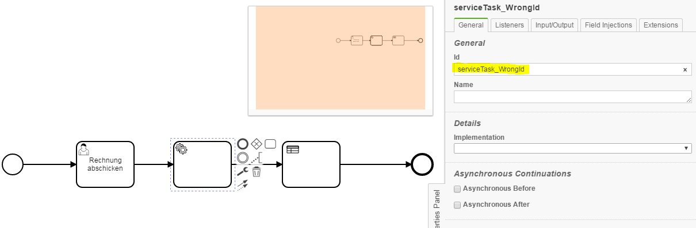

ElementIdConventionChecker
=================================
The ElementIdConventionChecker verifies if id of a specific task match a predefined naming convention.

## Assumptions
- The **BPMN-models** have to be in the **classpath** at build time

## Configuration
The rule should be configured as follows:
```xml
<rule>
		<name>ElementIdConventionChecker</name>
		<state>true</state>
		<elementConventions>
			<elementConvention>
				<name>ServiceTask</name>
				<pattern>serviceTask[A-Z]([A-Z0-9]*[a-z][a-z0-9]*[A-Z]|[a-z0-9]*[A-Z][A-Z0-9]*[a-z])[A-Za-z0-9]*</pattern>
			</elementConvention>
		</elementConventions>
	</rule>

```

`name` contains the element type to check.<br/>
`pattern` contains a regular expression, whereupon the Id of the element type above is checked. 

## Error messages

**"ID '%elementId' is against the naming convention**

_The id of the task is invalid and has to be changed according to the naming convention._

## Example

| **ID 'serviceTask_WrongId' is against the naming convention**                                          | 
|:------------------------------------------------------------------------------------------------------:| 
| name convention: `serviceTask[A-Z]([A-Z0-9]*[a-z][a-z0-9]*[A-Z]|[a-z0-9]*[A-Z][A-Z0-9]*[a-z])[A-Za-z0-9]*` (No underscore allowed) <br/> <br/>     |
| |
