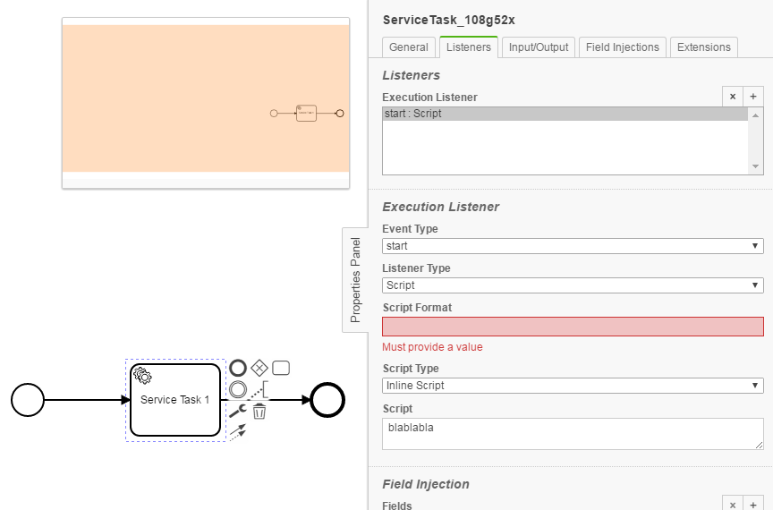
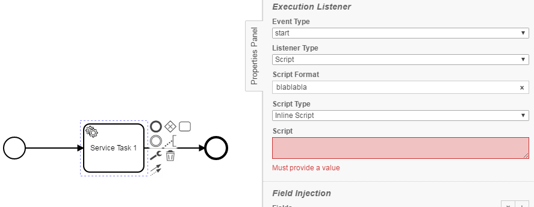
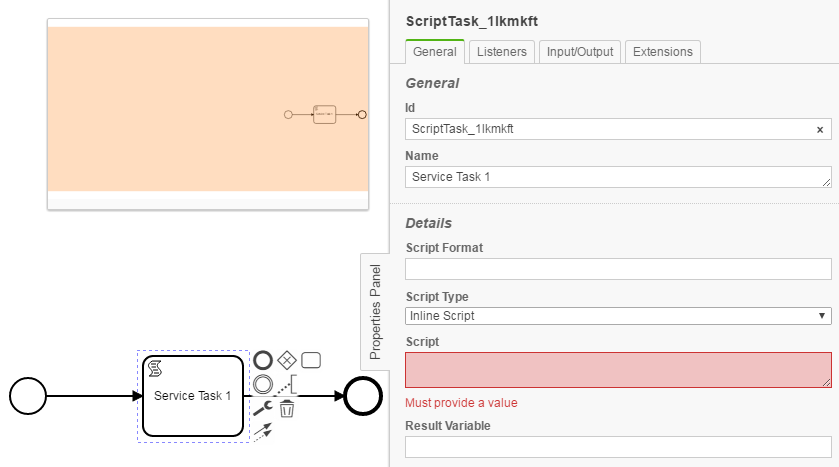
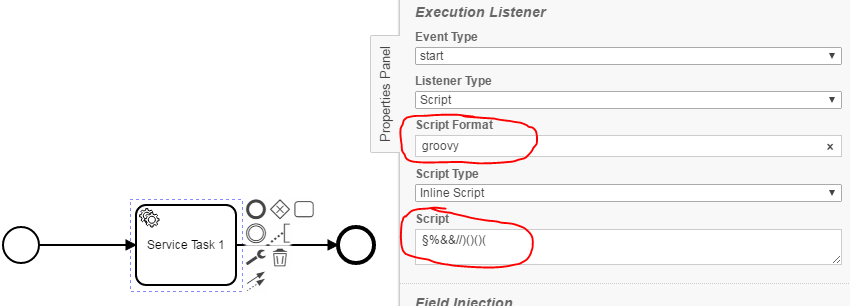

Embedded Groovy Script Checker
=================================
The Embedded Groovy Script Checker verifies embedded scripts in listeners and script tasks for validity.
For this purpose, it checks the following conditions:
- No script format is specified
- No script content is specified
- For Groovy only: The script content doesn't match the script format (syntax check)

## Assumptions
----------------------------------------------
- The **BPMN-models** have to be in the **classpath** at build time

## Configuration
------------------------------------------
The rule should be configured as follows:
```xml
<rule>
  <name>EmbeddedGroovyScriptChecker</name>
  <state>true</state>
</rule>
```

Via `<state>true</state>` the check can be enabled.

Via `<state>false</state>` the check can be disabled.

## Error messages
-----------------------------------------
**there is no script format for given script**

_There is no script format for an embedded script. A script format must be defined for the script._

**there is no script content for given script format**

_There is a script format, but no embedded script. A script must be created._

**there is an empty script reference**

_No script has been deposited. A script must be specified._

**[syntax checker message]**

_The syntax of the script is not valid. (for groovy only)_

## Examples
----------------------------------------

| **there is no script format for given script**                                                         | 
|:------------------------------------------------------------------------------------------------------:| 
|     |
| |

| **there is no script content for given script format**                                                 |
|:------------------------------------------------------------------------------------------------------:| 
|       |
| |

| **there is an empty script reference**                                                                 |
|:------------------------------------------------------------------------------------------------------:| 
|

| **startup failed: ....**                                                                               |
|:------------------------------------------------------------------------------------------------------:| 
    |

