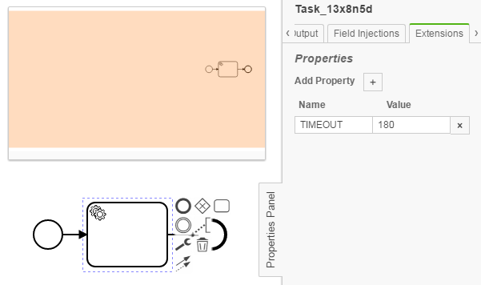
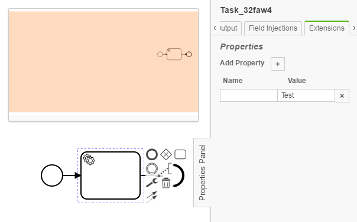
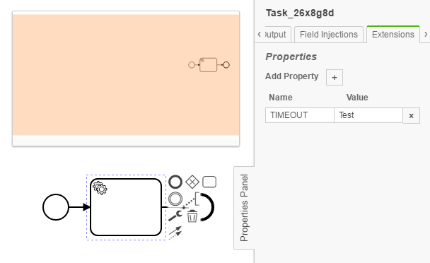

ExtensionChecker
=================================
The ExtensionChecker processes BPMN models and checks whether an element using key-value pairs in the extension panel fit into a desired regex scheme.

## Assumptions
- The **BPMN-models** have to be in the **classpath** at build time

## Configuration
The rule should be configured as follows:
```xml
<rule>
	<name>ExtensionChecker</name>
	<state>true</state>
	<settings>
		<setting name="TIMEOUT" type="ServiceTask" required="false">\d+</setting>
	</settings>
	<modelConventions>
		<modelConvention type="ServiceTask" />
		<modelConvention type="ScriptTask" />
		<modelConvention type="BusinessRuleTask" />
	</modelConventions>
</rule>

```
The rule for the ExtensionChecker consists of settings and modelConventions. By specifying the modelConventions, you create a whitelist of elements to include (mandatory for the checker to work, won't find issues otherwise) in the check.

By setting the attributes, you can configure the checker according to your needs. The attribute name is mandatory and acts as the key to be matched in the extension panel. If found, it will be checked if the value complies with the regex specified in the ruleSet (configurable Regex).  
The attributes "type" and "id" are used to distinguish tasks. By using "type", all tasks of the specified type will be checked and by using "id", only a certain task is checked. Please be aware that you **can not used both attributes** and have to opt for one or none. By not naming both attributes, the checker will search through all whitelisted elements looking for the key-value pair.  
Lastly, the attribute "required" specifies the way the check is done. If set to "true", it is mandatory that your model implements
a key-value extension pair for the specified id or task types (or none). If set to "false", it will look through the model and only validate the extension pair, if the keys match. 

## Error messages
**Key-Value pair of 'Task_123' could not be resolved due to incorrect or missing key.**

_This message indicates that the key specified in the model does not fit the key specified in the ruleSet.xml._


## Examples

| **Example of correct extension key-value pair**                                                                                    |
|:------------------------------------------------------------------------------------------------------:| 
|         |


| **Example of wrong extension key-value pair with missing key and usage of String instead Integer**                                                                                    |
|:------------------------------------------------------------------------------------------------------:| 
|         |


| **Example of wrong extension key-value pair with usage of String instead Integer**                                                                                    |
|:------------------------------------------------------------------------------------------------------:| 
|         |
