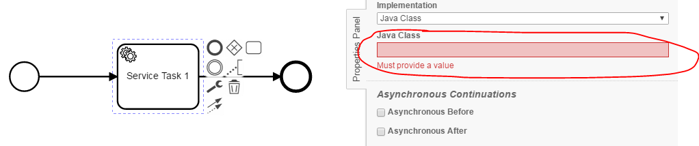
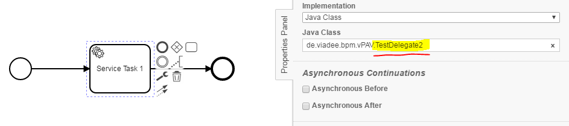
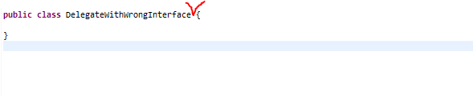
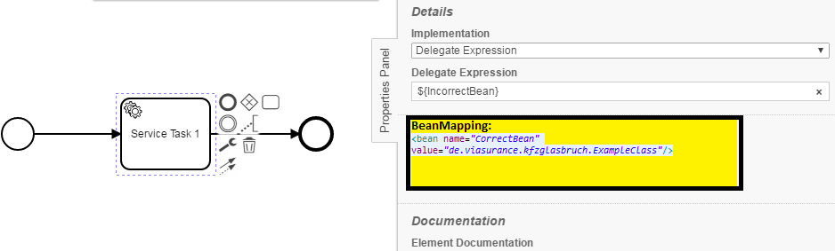

Java Delegate Checker
=================================
The Java Delegate Checker processes BPMN models and checks, whether the following conditions apply to 
Service Tasks, Send Tasks, Receive Tasks, Script Tasks or Business Rule Tasks:
- No implementation specified
- Class not found, although specified as implemented 
- Class doesn't implement the *JavaDelegate* or *SignallableActivityBehavior* interface or doesn't extends the *AbstractBpmnActivityBehavior* class

## Assumptions
----------------------------------------------
- The **BPMN-models** have to be in the **classpath** at build time
- The **java classes _(delegates)_** have to be in the **classpath** at build time

## Configuration
------------------------------------------
The rule should be configured as follows:
```xml
<rule>
  <name>JavaDelegateChecker</name>
  <state>true</state>
</rule>
```

Via `<state>true</state>` the check can be enabled.

Via `<state>false</state>` the check can be disabled.

## Error messages:
-----------------------------------------
**task '%taskName%' with no class name/delegate expression/expression/dmn reference/external topic/code reference**<br/>
_No reference to source code has been deposited. An implementation must be created._

**class for task '%taskName' not found**<br/>
_A Java class has been specified that does not exist. Check whether the package-path has changed (e.g. in the context of a refactoring) or the file has been accidentally deleted._

**class for task %taskName% does not implement/extends the correct interface/class**<br/>
_A Java class has been specified that doesn't implement the JavaDelegate or SignallableActivityBehavior interface or extends the AbstractBpmnActivityBehavior class._ <br/>
_The Java class have to be changed, so that it implements/extends the correct interface/class._

**Couldn't find correct beanmapping for delegate expression in task '%taskName'** <br/>
_Bean-name coudn't be found in the beanmapping.xml_

## Examples
----------------------------------------

| **No implementation specified**                                                                        | 
|:------------------------------------------------------------------------------------------------------:| 
|    |
| |

| **Class specified as implementation, but not found**                                                   |
|:------------------------------------------------------------------------------------------------------:| 
|                            |
| |

| **class does not implement/extends the correct interface/class**                                                |
|:------------------------------------------------------------------------------------------------------:| 
      |
| |

| **Couldn't find correct beanmapping for delegate expression in task 'Service Task 1'**                 |
|:------------------------------------------------------------------------------------------------------:| 
      |
