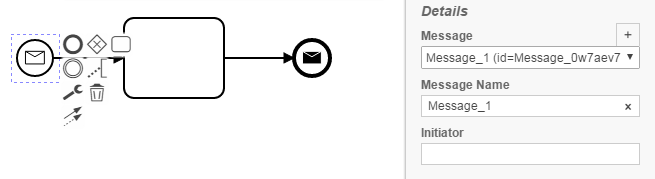
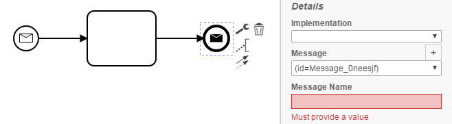
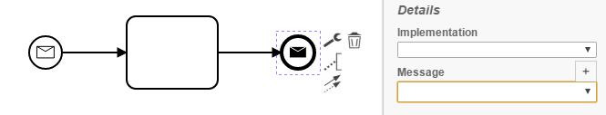

MessageEventChecker
=================================
The MessageEvent Checker processes BPMN models and checks whether a MessageEvent refers to a concrete message and names it accordingly 

- No message in ReceiveTask
- No message in IntermediateMessageCatchEvent
- No message name in IntermediateMessageCatchEvent
- No message in MessageEndEvent

## Assumptions
- The **BPMN-models** have to be in the **classpath** at build time

## Configuration
The rule should be configured as follows:
```xml
<rule>
  <name>MessageEventChecker</name>
  <state>true</state>
</rule>

```

## Error messages
**No message has been specified for %MessageEvent%**

_This message indicates that no message or message name was specified for a given MessageEvent._


## Examples

| **Correct usage**                                                                                    |
|:------------------------------------------------------------------------------------------------------:| 
|         |


| **No Message Name**                                                                                    |
|:------------------------------------------------------------------------------------------------------:| 
|         |


| **No Message**                                                                                    |
|:------------------------------------------------------------------------------------------------------:| 
|         |
