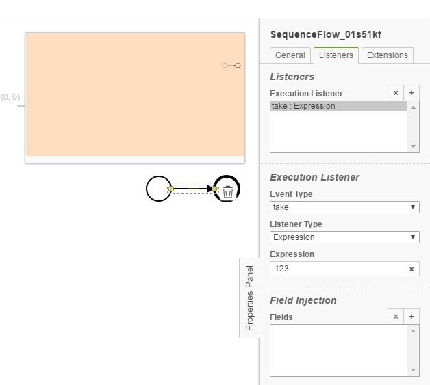

No Expression Checker
================================= 
The No Expression Checker processes BPMN models and checks whether there are expressions used against common best-practices in the model.

- Expression in TaskListener
- Expression in ExecutionListener
- Expression in Implementation
- Expression in MessageEndEvent

## Assumptions
- The **BPMN-models** have to be in the **classpath** at build time

## Configuration
The rule should be configured as follows:
```xml
<rule>
	<name>NoExpressionChecker</name>
	<state>true</state>
</rule>

```

You can add settings to disable the **NoExpressionChecker** in specific places. 
`name` contains the element type, in which the checker is deactivated.


``` xml
<rule>
	<name>NoScriptChecker</name>
	<state>true</state>
	<settings>
		<setting name="ScriptTask"></setting>
		<setting name="SequenceFlow"></setting>
	</settings>
</rule>
```

`name` can be:
- BusinessRuleTask
- ServiceTask
- SendTask
- ScriptTask
- UserTask
- ManualTask
- ExclusiveGateway
- SequenceFlow
- StartEvent
- IntermediateThrowEvent
- EndEvent


## Error messages:

**Usage of expression in %element% is against best practices.**

_There is an expression as implementation inside a task, an event or in a sequenceflow (execution listener)_


## Examples

| **Usage of expression in %element% is against best practices.**                                                                       | 
|:------------------------------------------------------------------------------------------------------:| 
|    |
| |

| **Usage of expression in listeners for %element% is against best practices.**                                                 |
|:------------------------------------------------------------------------------------------------------:| 
      |
| |
