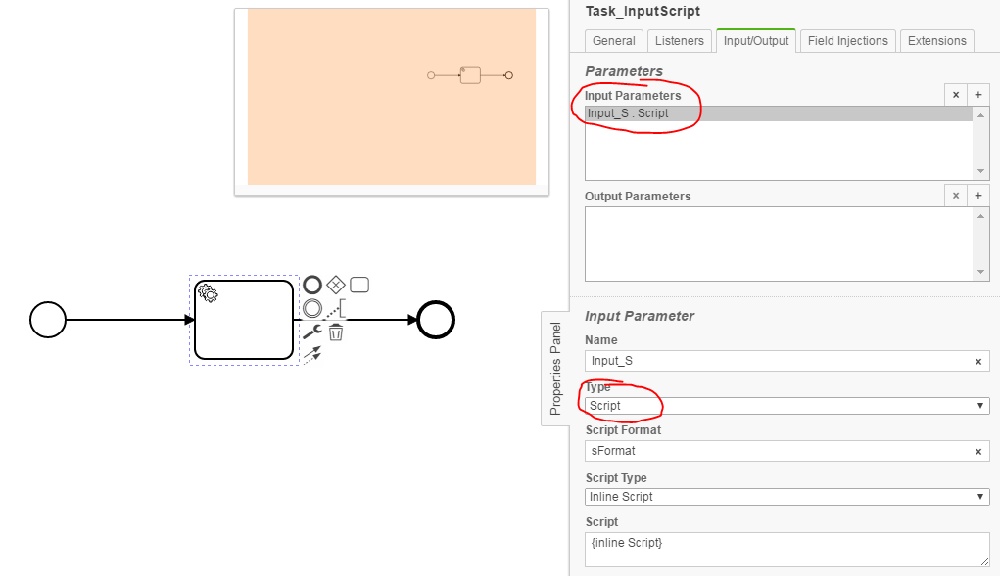
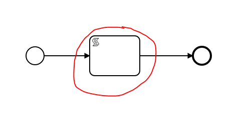

No Script Checker
================================= 
The No Script Checker processes BPMN models and checks whether there is a script in the model.

- ScriptTask
- Script in Listener
- Script in Input/Output

## Assumptions
- The **BPMN-models** have to be in the **classpath** at build time

## Configuration
The rule should be configured as follows:
```xml
<rule>
	<name>NoScriptChecker</name>
	<state>true</state>
</rule>

```

You can add settings to disable the **NoScriptChecker** in specific places. 
`name` contains the element type, in which the checker is deactivated.
If no `script` is specified, the checker is completely disabled for this element type.

``` xml
<rule>
	<name>NoScriptChecker</name>
	<state>true</state>
	<settings>
		<setting name="ScriptTask"></setting>
		<setting name="ServiceTask" script="outputParameter"></setting>
	</settings>
</rule>
```

`script` can be:
- inputParameter
- outputParameter
- executionListener
- taskListener
- conditionExpression

For more information go to [docs camunda](https://docs.camunda.org/manual/7.7/user-guide/process-engine/scripting/)

## Error messages:
**task %elementId with script**

_There is a script inside a script task or a script as an execution listener or a script as a task listener or a script inside an inputOutput parameter mapping_


**ScriptTask %elementId not allowed**

_ScriptTask not allowed_

## Examples

| **task %elementId with script**                                                                        | 
|:------------------------------------------------------------------------------------------------------:| 
|    |
| |

| **ScriptTask %elementId not allowed**                                                |
|:------------------------------------------------------------------------------------------------------:| 
      |
| |
