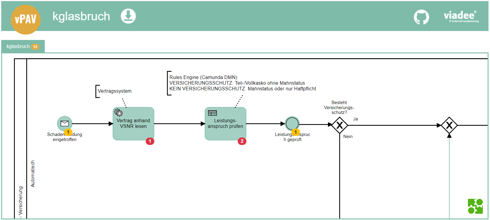
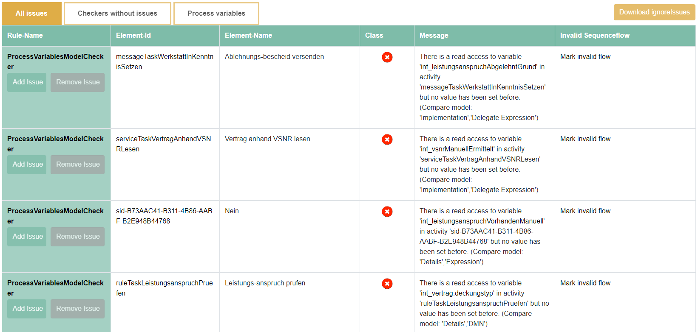
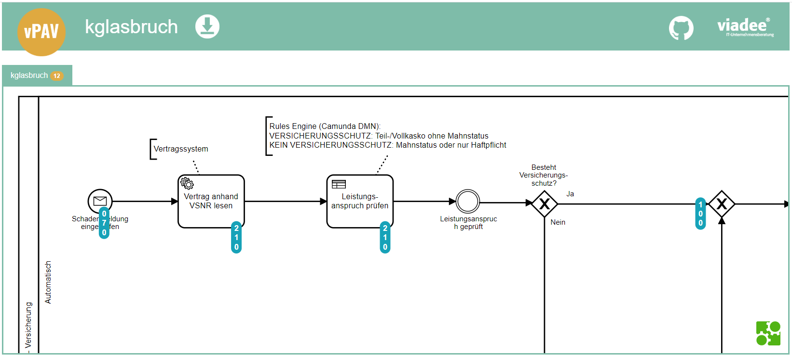
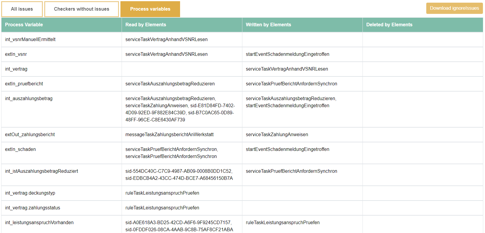

# Output
The result of the check is first of all a direct one: if at least one inconsistency is 
found on the ERROR level, it will break your build or count as a failed unit 
test which will break your build too.

Further, the consistency check will provide an XML version, a JSON version and
an visual version based on  [BPMN.io](https://bpmn.io/) of all errors and warnings found.

## Visual output
A HTML page is gerenated to visualize the validation results.
To find the visual output, check the created vPAV folder inside your project's target folder. 
Open the `validationResult.html` with any browser to explore your process model and the found issues.

The header contains the name of the current model. 
Below the heading, you can select a different model of the project to be displayed.
You can zoom in and out with the mouse wheel and move the model by click and hold.

There are two different view modes with each providing a different overlay for the model and tables with additional information.

### Issue Overlay
In the BPMN model, the elements with errors are highlighted. Error categories are indicated by color. 
An overlay specifies the number of errors found on an element. Details can be seen by clicking on the overlay.
All errors are laid out in a table below the model. Clicking on the _rulename_ opens the corresponding documentation.
Clicking on the _Element-Id_ or _invalid sequenceflow_ marks the corresponding element(s) in the model.

#### Model

#### Issue Table

### Variable Overlay

In the BPMN model, all detected operations to process variables are highlighted. 
An overlay specifies the number of reads, writes and deletes.
By clicking on the overlay further information can be obtained including the names of process variables and exact location of operation.
A table below the model lists all process variable and their operations.
Clicking on the process variable name highlights all model elements with operations to this variables.
Clicking on element IDs marks the corresponding element in the model.

#### Model

#### Issue Table

