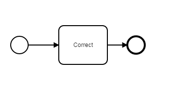
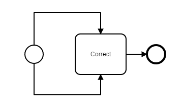

OverlapChecker
=================================
The OverlapChecker processes BPMN models and checks whether there are redundant edges (same source and target) exist.

## Assumptions
- The **BPMN-models** have to be in the **classpath** at build time

## Configuration
The rule should be configured as follows:
```xml
<rule>
	<name>OverlapChecker</name>
	<state>true</state>
</rule>

```

## Error messages
**Multiple SequenceFlows detected. Delete 'SequenceFlow_123'  with identical source and target.**

_This message indicates that at least two or more sequence flows with identical source and target exist._


## Examples

| **Example of correct sequence flow**                                                                                    |
|:------------------------------------------------------------------------------------------------------:| 
|         |


| **Example of incorrect/redundant sequence flow**                                                                                    |
|:------------------------------------------------------------------------------------------------------:| 
|         |
