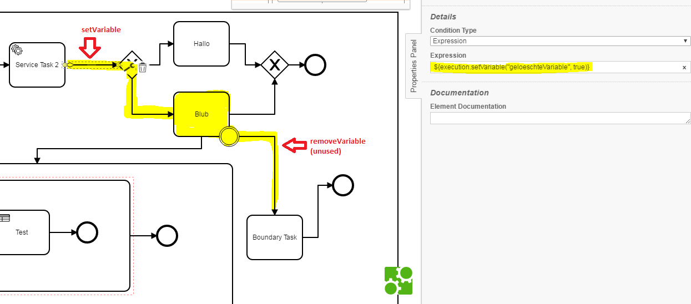
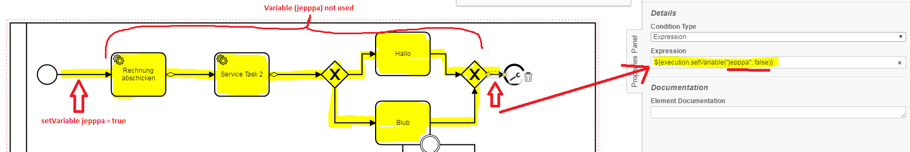
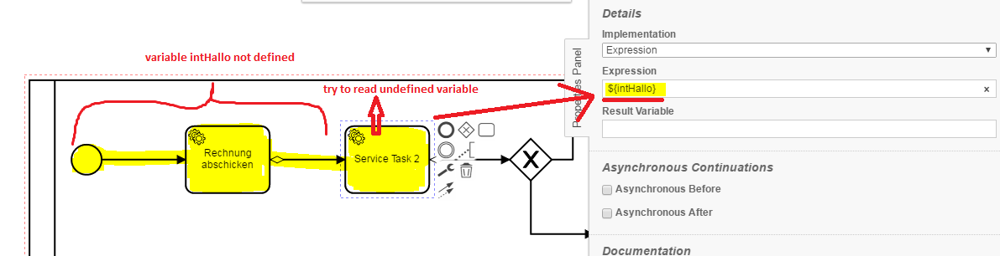

Process Variables Model Checker
=================================
The Process Variables Model Checker processes BPMN models and checks a model for anomalies in the data flow. The following anomalies are checked:
```
- DD (Overwritten)
- DU (Defined-Deleted)
- UR (Undefined-Reference)
- UU (Undefined-Undefined)
```
U – Deletion of a value (undefine)  
D – Value assignment (define)  
R – Reading a value (reference)  


## Assumptions
- The **BPMN-models** have to be in the **classpath** at build time

## Configuration
The rule should be configured as follows:
```xml
<rule>
  <name>ProcessVariablesModelChecker</name>
  <state>true</state>
  <settings>
    <setting name="UseStaticAnalysisBoolean">true</setting>
  </settings>
</rule>

```


## Error messages
**process variable creates an anomaly (compare %Chapter%,%ElementFieldType%)**

_This message indicates that an anomaly was found for a certain process variable._

For debugging purposes check **%Chapter%** and **%ElementFieldType%**.

## Examples

| **Defined-Deleted**                                  | 
|:------------------------------------------------------------------------------------------------------:| 
|             |
| |

| **Defined-Defined (Overwritten)**                                  | 
|:------------------------------------------------------------------------------------------------------:| 
|             |
| |

| **Undefined-Reference**                                  | 
|:------------------------------------------------------------------------------------------------------:| 
|             |
| |
