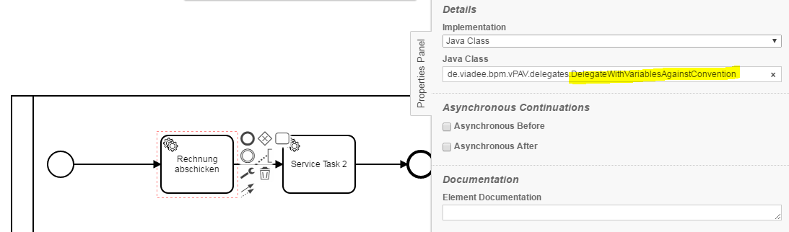
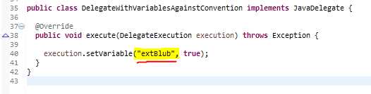
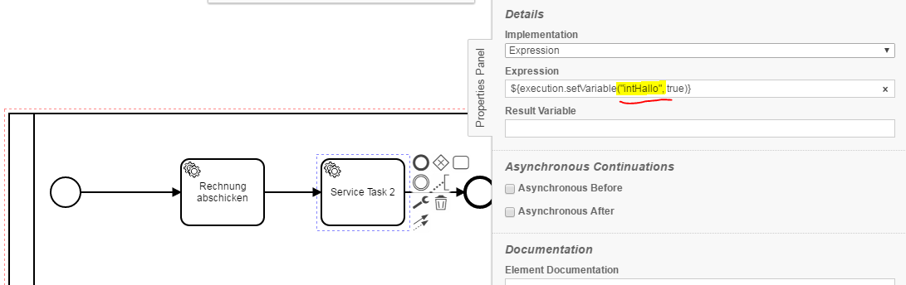
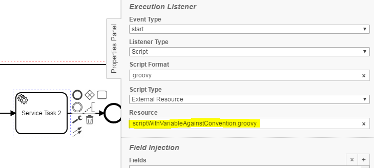
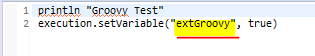

Process Variables Name Convention Checker
=================================
Elements in business processes are regularly subject to naming conventions. This checker validates the names of process variables with a configurable regular expression.

## Assumptions
----------------------------------------------
- The **BPMN-models** have to be in the **classpath**

## Configuration
------------------------------------------
The rule should be configured as follows:
```xml
<rule>
    <name>ProcessVariablesNameConventionChecker</name>
    <state>true</state>
    <elementConventions>
      <elementConvention>
        <name>internal</name>
        <!-- field types for process variables -->
        <elementFieldTypes excluded="true">
          <elementFieldType>Class</elementFieldType>
          <elementFieldType>ExternalScript</elementFieldType>
          <elementFieldType>DMN</elementFieldType>
          <elementFieldType>DelegateExpression</elementFieldType>
        </elementFieldTypes>
        <pattern>int_[a-zA-Z]+</pattern>
      </elementConvention>
      <elementConvention>
        <name>external</name>
        <!-- field types for process variables -->
        <elementFieldTypes>
          <elementFieldType>Class</elementFieldType>
          <elementFieldType>ExternalScript</elementFieldType>
          <elementFieldType>DMN</elementFieldType>
          <elementFieldType>DelegateExpression</elementFieldType>
        </elementFieldTypes>
        <pattern>ext_[a-zA-Z]+</pattern>
      </elementConvention>
    </elementConventions>
  </rule>
```

Via `<state>true/false</state>` the check can be enabled or disabled

For internal and external naming conventions, `elementConventions` must be defined.<br/>
An element convention consists of:
- a `name`
- an `elementFieldType` to be analyzed
- a regular expression for the naming convention (`pattern`)

The attribute `excluded = "true"` means that all element field types, except those that are stored, should be checked.

**ElementFieldType can take the following values:**<br/> 
_Class, FormField, Expression, DelegateExpression, ResultVariable, CalledElement, CaseRef, CollectionElement, ElementVariable,_ 
_LoopCardinality, CompletionCondition, InlineScript, ExternalScript, Assignee, CandidateUsers, CandidateGroups, DueDate, FollowUpDate, DMN, CamundaIn and CamundaOut._ 


## Error messages
-----------------------------------------
**process variable is against the naming convention '%conventionName%' (compare %Chapter%, %ElementFieldType%)**

_The message indicates that a process variable violates a specific naming convention._<br/>
_%ConventionName% contains the name of the convention that has been defined within the rule._<br/>
_%Chapter% and %ElementFieldType% contain information on where the process variable can be found in the Camunda Modeler for the specific BPMN element._


_**Solution:** the variable has to be adapted to the convention._


## Examples
----------------------------------------

| **process variable is against the naming convention 'external' (compare Details, Class)**              | 
|:------------------------------------------------------------------------------------------------------:| 
| <br/><br/>   |
| |

| **process variable is against the naming convention 'internal' (compare Details, Expression)**         | 
|:------------------------------------------------------------------------------------------------------:| 
|              |
| |

| **process variable is against the naming convention 'external' (compare ExecutionListener, External Script)**| 
|:------------------------------------------------------------------------------------------------------------:| 
| <br/>scriptWithVariableAgainstConvention.groovy: <br/>   |
| |

