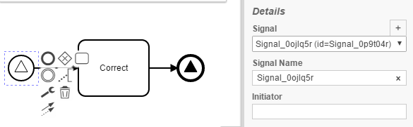
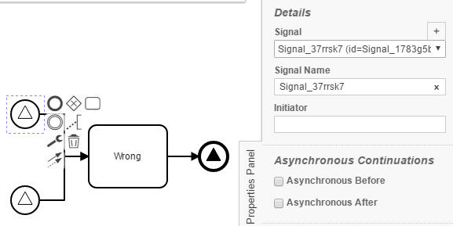

MessageEventChecker
=================================
The SignalEventChecker processes BPMN models and checks whether a SignalEvent refers to a signal and names it accordingly. 
It validates that there exists a message and a message name for StartEvents, EndEvents, IntermediateThrowEvents and BoundaryEvents. In Addition it checksif more than one SignalStartEvent use the same Signal Name


## Assumptions
- The **BPMN-models** have to be in the **classpath** at build time

## Configuration
The rule should be configured as follows:
```xml
<rule>
  <name>SignalEventChecker</name>
  <state>true</state>
</rule>

```

## Error messages
**Signal Names have to be used uniquely in StartEvents. Compare: %Event1% and %Event2%**

_This message indicates that the Signal name has been used more than once._


## Examples

| **Correct usage**                                                                                    |
|:------------------------------------------------------------------------------------------------------:| 
|         |


| **Incorrect usage**                                                                                    |
|:------------------------------------------------------------------------------------------------------:| 
|         |
