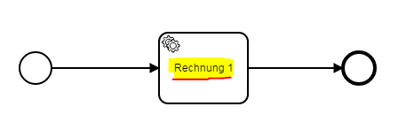

Task Naming Convention Checker
=================================
The Task Naming Convention Checker verifies if tasks match a predefined naming convention.

## Assumptions
- The **BPMN-models** have to be in the **classpath** at build time

## Configuration
The rule should be configured as follows:
```xml
<rule>
    <name>TaskNamingConventionChecker</name>
    <state>false</state>
    <elementConventions>
        <elementConvention>
            <name>convention</name>
            <description>taskname has to start with a capital letter followed by letters,hyphens or spaces</description>
            <pattern>[A-ZÄÖÜ][a-zäöü\\\-\\\s]+</pattern>
        </elementConvention>
    </elementConventions>
</rule>

```

An element convention consists of:
- a `name`
- a regular expression for the naming convention (`pattern`)
- a `description` to describe the convention (optional)

## Error messages
**task name must be specified**

_The task name is missing and has to be specified in the model._

**task name '%taskName%' is against the naming convention**

_The task name is invalid and has to be changed according to the naming convention._

## Example

| **task name 'Rechnung 1' is against the naming convention**                                                                        | 
|:------------------------------------------------------------------------------------------------------:| 
| name convention: `[A-ZÄÖÜ][a-zäöü\\-\\s]+` (All words starting with a capital letter and containing no number) <br/> <br/>     |
| |
