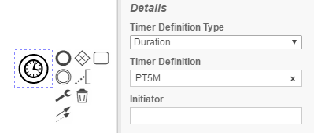
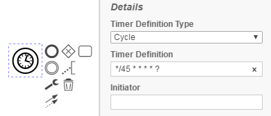

Timer Expression Checker
=================================
The Timer Expression Checker processes BPMN models and checks if time events follow the ISO 8601 scheme.

- No TimerDefinitionType
- No TimeDefinition
- Wrong TimeDefinition (against ISO8601 or CRON)

## Assumptions
- The **BPMN-models** have to be in the **classpath** at build time

## Configuration
The rule should be configured as follows:
```xml
<rule>
	<name>TimerExpressionChecker</name>
	<state>true</state>
</rule>
```


## Error messages:
**time event '%timeEvent%' does not follow the ISO 8601 scheme for timeDates.**

_Due to the camunda engine using the ISO 8601 scheme, it is required for users to follow this scheme._


**time event '%timeEvent%' does not follow the scheme for CRON jobs.**

_Expressions following the QUARTZ Cron definition are also allowed, if implemented correctly._

## Examples

| **Correct use of a ISO 8601 expression for a duration**                                                                        | 
|:------------------------------------------------------------------------------------------------------:| 
||
| |

| **Correct use of a CRON expression**                                                                        | 
|:------------------------------------------------------------------------------------------------------:| 
||
| |

