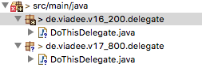

Versioning Checker
=================================
The Versioning Checker checks references in Service Tasks, Script Tasks, Business Rule Tasks, Send Tasks, Listenern and Message Events
to the declaration of a versioned java implementation.
When a versioned implementation is referenced, it is checked whether it is up-to-date.

- No version
- Outdated version

## Assumptions
- The **BPMN-models** have to be in the **classpath** at build time
- Classes or packages have to be versioned

## Configuration
The rule should be configured as follows, if you want to use a versioning scheme on a file level:
```xml
<rule>
  <name>VersioningChecker</name>
  <state>true</state>
  <settings>
  	<setting name="versioningSchemeClass">([^_]*)_{1}([0-9][_][0-9]{1})\.(java|groovy)</setting>
  </settings>
 </rule>
```
The setting „versioningSchemeClass“ includes a file name scheme (regular expression) for versioned classes.
This is required for the identification of such classes, here e.g. \<name\>\_\<majorversion\>\_\<minorversion\>.java/groovy


Alternatively, if you use a package-based versioning scheme, the rule should be configured like below
```xml
<rule>
  <name>VersioningChecker</name>
  <state>true</state>
  <settings>
  	<setting name="versioningSchemePackage">v\d+_\d+</setting>
  </settings>
 </rule>
```
The setting "versioningSchemePackage" includes an exemplary regular expression that matches package-based versioning, e.g.
de.viadee.package.v10_19.example. This versioning scheme would be identified and in comparison, de.viadee.package.v12_20.example would be tagged as the newer version. This scheme is configurable as you desire. Beware, that as of now, the number of digits have to match and you need to fill up numbers with preceeding zeros.

If the versioning scheme is based on packages, it is **mandatory** to adhere to our assumptions, i.e. two packages with different versions still contain the same classes (see figure below), else the VersioningChecker will malfunction.




Note, that **only one versioning scheme** can be used.

Via `<state>true</state>` the check can be enabled.

_If VersioningChecker is enabled, but no settings for "versioningSchemeClass" or "versioningSchemePackage" are set, the checker will throw a **ConfigItemNotFoundException**. This does not cancel the JUnit test.

Via `<state>false</state>` the check can be disabled.

## Error messages
**class reference is deprecated or file with version doesn't exist**

_A referenced Java class is deprecated or isn't versioned._
_If the referenced class is deprecated, change the reference to the current version._
_Unless a versioned class is undeposited, it must be adapted to the version name convention._

**script reference is deprecated or file with version doesn't exist**

_A referenced script is deprecated or isn't versioned._
_If the referenced script is deprecated, change the reference to the current version._
_Unless a versioned script is undeposited, it must be adapted to the version name convention._

**bean reference is deprecated or file with version doesn't exist**

_A referenced spring-bean is deprecated or isn't versioned._
_If the referenced spring-bean is deprecated, change the reference to the current version._
_Unless a versioned spring-bean is undeposited, it must be adapted to the version name convention._


## Examples

| **current situation**                                                                                               | **class reference is deprecated or file with version doesn't exist**               | 
| :---------------------------------------------------------------------------------------------------------------:|:---------------------------------------------------------------------------:| 
| newest version is <br/> *de/test/TestDelegate_1_2*                                                                ||

|                                                                                                  | **script reference is deprecated or file with version doesn't exist**       | 
| :---------------------------------------------------------------------------------------------------------------:|:---------------------------------------------------------------------------:| 
| newest version is <br/> *de/test/testScript_1_2.groovy*                                                              | |


|                                                                                                  | **bean reference is deprecated or file with version doesn't exist**                | 
| :---------------------------------------------------------------------------------------------------------------:|:----------------------------------------------------------------------------------:| 
| beanmapping: <br/> myBean_1_1  **<->**  de.test.TestDelegate\_1\_1 <br/><br/> newest version is<br/> *de/test/TestDelegate_1_2*      |  | 


