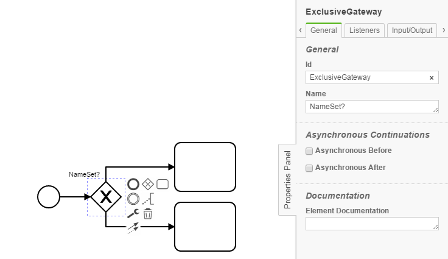

XOR Naming Convention Checker
=================================
The XOR Naming Convention Checker processes BPMN models and checks if XOR gateways end with "?".
For future use, we aim to implement a regex check to verify predefined naming conventions.

## Assumptions
----------------------------------------------
- The **BPMN-models** have to be in the **classpath** at build time

## Configuration
------------------------------------------
The rule should be configured as follows:
```xml
<rule>
	<name>XorNamingConventionChecker</name>
	<state>true</state>
</rule>

```

## Error messages:
-----------------------------------------
**Naming convention of XOR gate '%gatewayName%' not correct.**

_The default naming convention requires XOR gateways to end with "?"._

## Examples
----------------------------------------

| **Correct use of naming convention**                                                                        | 
|:------------------------------------------------------------------------------------------------------:| 
||
| |

